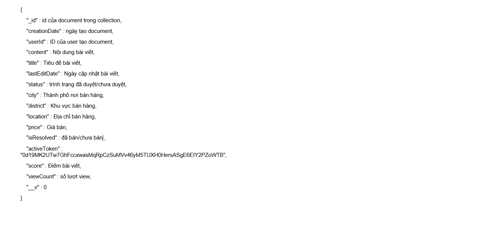
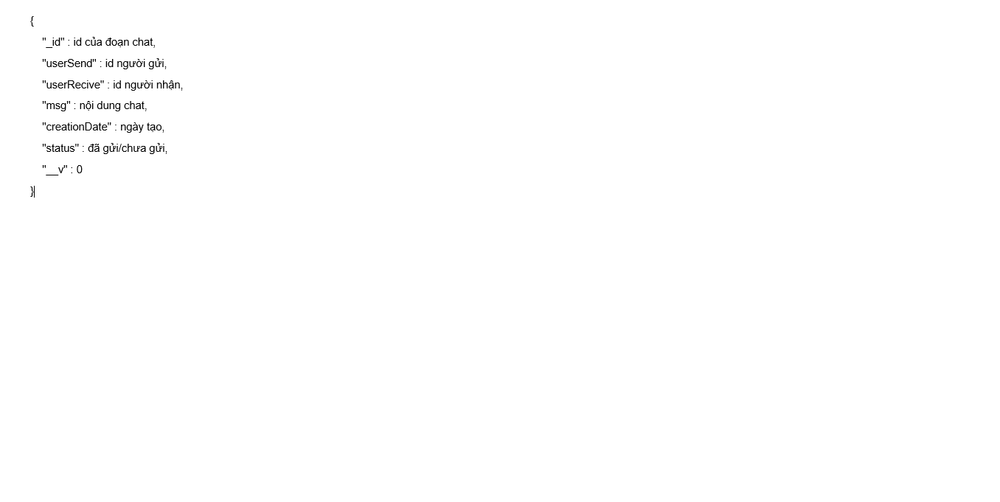
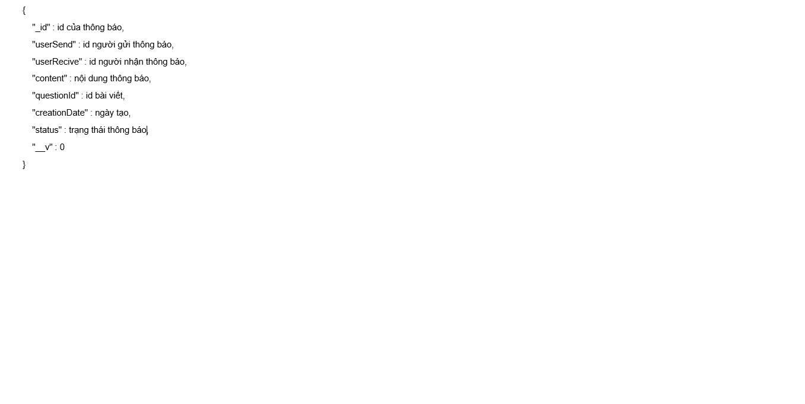
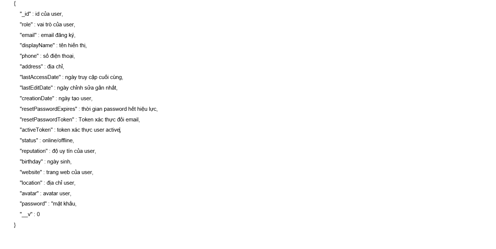
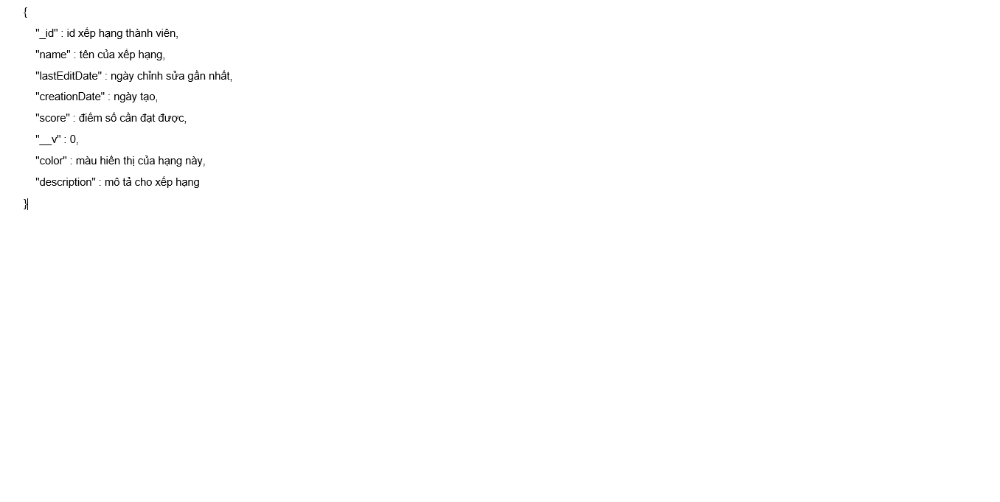
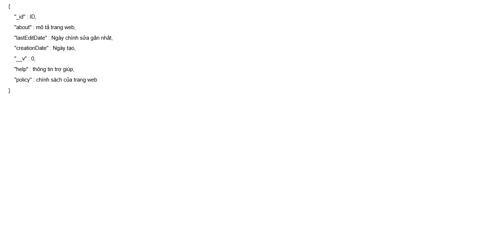

#Đồ án môn học Ứng dụng phân tán - FIT - HCMUS - 2016

1. **Giáo viên:**
	* Hoàng Anh Tú
	* Phạm Minh Tú
	* Bùi Đắc Thịnh

2. **Thành viên nhóm:** 
	* 1112142: Hoàng Nguyễn Anh Khoa
	* 1212087: Phạm Phú Đoàn
	* 1212302: Huỳnh Trần Kim Phượng
	* 1212447: Trần Đình Trọng

3. **Các chức năng đã thực hiện**
	* [x] Đăng ký tài khoản bằng email/sdt, password và tên
	* [x] Đăng nhập bằng email/sdt, password
	* [x] Khôi phục tài khoản bằng email/sdt
	* [x] Xem danh sách các bài đăng
	* [ ] Tìm kiếm bài đăng
	* [ ] Tìm kiếm bài đăng nâng cao
	* [x] Xem chi tiết bài đăng
	* [x] Đăng bài viết mới
	* [x] Chỉnh sửa bài viết
	* [x] comment trong bài viết
	* [x] gửi tin nhắn cho user
	* [x] lọc bài viết theo category
	* [x] Thông báo khi có người comment bài viết, khi admin duyệt bài
	* [x] **Admin** duyệt bài viết của user
	* [x] **Admin** chỉnh sửa bài viết của user
	* [x] **Admin** xóa bài viết của user
	* [x] **Admin** xóa user
	* [x] **Admin** chỉnh sửa vai trò của user

4. **Các chuẩn đầu ra đạt được**

| Thành viên | G1.2 | G3.1 | G5.1 | G5.2 | G5.3 và G5.5 | G5.4 | G6.1 và G6.2 | G7.1 | G8.1 | G8.3 |
| ---------- |:----:|:----:|:----:|:----:|:------------:|:----:|:------------:|:----:|:----:|-----:|
| 1112142    |9     |9     |10    |10    |7             |7     |7             |5     |5     |9     |
| 1212087    |7     |7     |10    |10    |7             |7     |5             |5     |5     |7     |
| 1212302    |0     |0     |0     |0     |0             |0     |0             |0     |0     |0     |
| 1212447    |3     |0     |0     |0     |0             |0     |0             |0     |0     |0     |

5. **Wireframe **

6. **Data Schema **
	* Question
	
	* Answer
	
	* Chat
	
	* Nontification
	
	* Tag
	
	* User
	
	* Badges
	
	* Question Tag
	
	* System
		
7. **Demo**